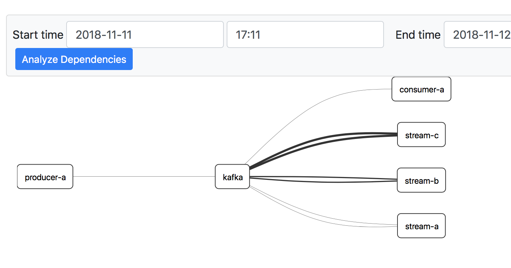

# Kafka/Kafka Streams Zipkin tracing example

This project shows example of Zipkin tracing integration for Kafka Consumers/Kafka Producer/Kafka Streams

# How to trace Kafka/Kafka Streams

- Add Zipkin dependencies like in [build.gradle](build.gradle)
- Check if your framework (Spring Boot, etc.) has integration with Zipkin already
- If not - create [Tracer manually](src/main/kotlin/app/Tracer.kt)
- Wrap your [Kafka Consumers](src/main/kotlin/app/KafkaConsumer.kt) or [Kafka Producer](src/main/kotlin/app/KafkaProducer.kt) or [Kafka Streams](src/main/kotlin/app/KafkaStreamsOneToOne.kt) with tracer

# Open issues

Zipkin injects tracing information into message headers which unforunately accessible only in Producer/Transormers, not in regular `map/filter/reduce` code. You can read more about it in [official documentation](https://github.com/openzipkin/brave/tree/master/instrumentation/kafka-streams). Because of that on tracing map you see all `poll/send` commands but nothing in between. 